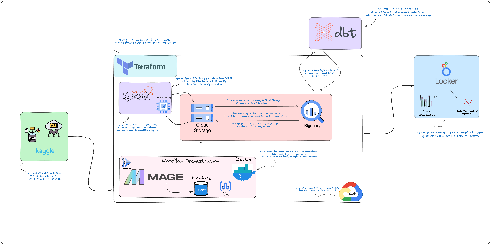

# QuakeWatch: Tracking Earthquakes Worldwide 🌍🌋
Earthquakes shake things up on our planet 🌍, and QuakeWatch is here to keep an eye on them! Through real-time monitoring, interactive visualizations, and predictive analytics, QuakeWatch aims to provide valuable insights into seismic activity and contribute to efforts in disaster preparedness and response.

## What's Our Mission? 🎯
At QuakeWatch, our mission is to leverage Big Data to gain deeper insights into global earthquake activity. We aim to address key questions in the field:

- How frequently do earthquakes occur worldwide, and what patterns do they follow?
- Where are the earthquake epicenters located, and are there any identifiable hotspots?
- What is the distribution of earthquake activity across different regions and continents?
- How do various factors such as magnitude, depth, and geographical location influence earthquake occurrences?

## What makes this project cool? 😎
- **Real-time Monitoring:** Stay updated with the latest seismic events worldwide.
- **Interactive Visualizations:** Explore earthquake data through interactive maps and graphs.
- **Predictive Analytics:** Get insights into future earthquake occurrences.
- **Continuous Improvement:** We're always evolving to provide the best experience.
 
## Technologies 🔬
For this project the following technologies were used:
- Containerization: [*Docker*](https://www.docker.com/)
- Workflow orchestration: [*Mage*](https://www.mage.ai/)
- Infrastructure as code (IaC): [*Terraform*](https://www.terraform.io/)
- Google Cloud Platform(GCP):
    - Data Lake: [*Google Cloud Storage (GCS)*](https://cloud.google.com/storage)
    - Data Warehouse: [*BigQuery*](https://cloud.google.com/bigquery)
    - Virtual Machine: [*Compue Engine*](https://cloud.google.com/compute)
    - Container Images [*Artifact Registry*](https://cloud.google.com/artifact-registry)
    - Run Containers [*Cloud Run*](https://cloud.google.com/run/docs/overview/what-is-cloud-run)
- Transforming data: [*dbt*](https://www.getdbt.com/)
- Data Visualization: [*Looker Studio*](https://lookerstudio.google.com/)

## Dataset Overview  📊
We gathered our earthquake data using the EveryEarthquake API.You can access the data collected between January and April 2023 in the ["quakewatch-dataset"](/quakewatch-dataset) folder as parquet files, organized by week.

To use the EveryEarthquake API, you'll need an X-RapidAPI-Key. You can get your key by creating an account; more details can be found [here](https://rapidapi.com/dbarkman/api/everyearthquake/).

### Dataset Contents 📦
Our dataset, that we gonna use, contains the following information:

- **ID:** A unique identifier for each earthquake event.
- **Magnitude:** The strength of the earthquake.
- **Felt Reports:** The number of reports from people who felt the earthquake.
- **Depth:** How deep underground the earthquake started.
- **Latitude and Longitude:** Coordinates of the earthquake's epicenter.
- **Distance to Populated Places:** The distance to nearby populated areas from the earthquake.
- **Date:** The date when the earthquake occurred.
- **Year and Week:** The year and week of the year when the earthquake occurred.
- **Country:** The country where the earthquake occurred.
- **City and Locality:** The city and locality where the earthquake occurred.
- **Continent:** The continent where the earthquake occurred.
  

## Project architecture 🏗️

> I've made a good and clear architecture that makes our work easier to continue once we have it. So basically idea is collecting all the datasets from the different sources and API, after we will do some ETL then store this data in Google Cloud Storage

# Extract, transform, load (ETL): Mage 📥 🔄 📤
So, our task involves first reading the data, performing some transformations (such as cleaning the data), and then writing this data to our database (which is the interesting part). After that, we will write this data to Google Cloud Storage (GCS). The good part is that we will not manually code and attach. Instead, we will use Mage.
### 1. Setting Up Environments 🛠️
   - First, let's configure Mage AI and PostgreSQL using Docker. We'll create a Docker Compose file for seamless setup. Check out ["mage-ai"](/mage-ai) for detailed instructions and Docker files. 🐳

### 2. Extraction 📥
  - Our data extraction process relies on APIs. We've written some Python [scripts](/) to read and export the data from the API. Initially, we're storing the data locally in our ["quakewatch-dataset"](/quakewatch-dataset) folder for easy access and sharing with others. 📦

### 3. Transformation 🔄
 - With the data locally available, we move on to transformation. This involves basic tasks like converting timestamps, renaming columns, and fixing any typos in location names. The transformation script files can be found [here](/). 🔄
  
### 4. Loading 🧬
  - After extraction and transformation, it's time to load the data. We've chosen to load it into two data repositories. The first is our local PostgreSQL database for quick access and analysis. The second is Google Cloud Storage (GCS) for scalability and for accessing it further through [BigQuery](https://en.wikipedia.org/wiki/BigQuery).

# Google Cloud ☁️ 
For cloud services, we're using Google Cloud Platform (GCP), which offers a $300 free trial—an excellent opportunity for beginners to explore and test cloud services. Having used both GCP and AWS, in my opinion, GCP stands out with its better UI/UX, although AWS is also commendable.

So, what kind of services do we need for this project? Below, I'll provide and write about them in detail.
### 1. Google Cloud Storage 🗄️
Cloud Storage is a service for storing objects in Google Cloud. An object is an immutable piece of data consisting of a file of any format. You store objects in containers called buckets, similar to AWS S3 buckets.

I utilize Google Cloud Storage (GCS) to store all my datasets in various formats like CSV, Parquet, etc., enabling easy access from this storage.

### 2. Big Query 📊
Google BigQuery is a serverless, highly scalable data warehouse with a built-in query engine. The query engine can execute SQL queries on terabytes of data in seconds and petabytes in minutes, all without managing any infrastructure or creating/rebuilding indexes.

We load data from GCS into BigQuery, leveraging its powerful querying capabilities. Once data is in BigQuery, we can further analyze it—dbt can access it, and we can use tools like Looker for visualization.

### 3. Cloud Run ☁️🏃‍♂️
Cloud Run is a service where we can run our Docker images. It's simple and easy to use.

In this project, we opted not to have Mage AI running locally. Instead, we created a Docker image of it and then ran it on Cloud Run. Now our Mage AI is hosted on Cloud Run, enabling collaboration and ease of access. All steps were performed using Terraform, making it easy to destroy the setup if needed.

### 4. Compute Engine 💻
Compute Engine provides virtual machines (VMs) on the cloud that we can use for various purposes.

I provisioned an Ubuntu VM and did some configs + also installed Docker, Jupyter, and other necessary tools and software that I'll be using. Currently, I'm running Apache Spark inside this VM for data processing tasks.

# Infrastructure as code : Terraform 🔧
Terraform was used to build and manage GCP infrastructure. Terraform configuration files are located in the terraform folder, where you can find detailed information about the files:

- [variables.tf](./terraform/variables.tf): contains variables to make your configuration more reproducible.
- [main.tf](./terraform/main.tf): is a key configuration file consisting of several sections.

### Usage 🪄
To streamline the process, a Makefile with basic configurations has been provided. Here's how to use it:

- Ensure you're in the terraform folder using the bash command `cd terraform`.
- Run `make run` to execute all necessary Terraform commands and apply changes. Simply type `yes` to confirm.
- To remove the stack from the Cloud, use `make kill`.

> With the Makefile, executing Terraform commands becomes as simple as running a single command!

# Transforming data: dbt 🧬
dbt (data build tool) was used for data transformation in the Data Warehouse (DWH) for further analytics dashboard development.

dbt connected with BigQuery, allowing seamless transformation of data within the warehouse. Whenever I needed to perform analytics, I simply took the relevant tables, wrote some models (and macros if necessary), then compiled and built them back, resulting in new and transformed tables inside BigQuery. This process enabled easy visualization and even running of some machine learning models.

Check the dbt [folder](./dbt/) to learn more about dbt and how it works. Personally, I found dbt to be an interesting tool for its versatility and efficiency. Additionally, here's another full repo I have about [dbt-analytics](https://github.com/mutasim77/dbt-analytics) that you can explore for more insights.

# Looker 📊🔍
Looker Studio converts complex data sets into user-friendly reports, enabling the integration of data from multiple sources into one platform.

At the end of our data pipeline, we use Looker to generate reports that summarize and visualize our data effectively. By importing datasets from BigQuery into Looker, we can create dynamic and interactive dashboards that allow for deeper exploration of our data.

For access to the reports generated using Looker, please visit [this link](https://lookerstudio.google.com/u/0/reporting/90f642f4-eb68-4f62-b164-32e038ab65ed/page/82RzD).

# Machine Learning 🤖🧠
Machine learning is all about making predictions, and QuakeWatch is diving into this exciting field. With the vast amount of earthquake data we've collected, why not use machine learning to predict future seismic events?

The goal is both challenging and intriguing: create a model that can forecast earthquakes. After careful consideration, I decided to use the Random Forest regression algorithm. It's known for its ability to handle complex datasets and produce reliable predictions.

I focused specifically on predicting earthquakes in Central Asia(dataset can be found [here](./quakewatch-dataset/)), an area prone to seismic activity. By training the model on past earthquake data and relevant information, I aimed to gain insights into future earthquakes in the region.

For those interested, you can find the complete code for this ML model [here](./ml-models/)

## Conlusion 🎉
QuakeWatch has been an exhilarating journey into the heart of earthquake monitoring and analysis. From real-time tracking to predictive analytics, this project has explored the dynamic landscape of seismic activity with a keen eye for detail.

🌍 Our mission to leverage Big Data for deeper insights into global earthquake activity has led to invaluable discoveries and contributed to disaster preparedness efforts worldwide.

😎 What makes QuakeWatch truly special is its commitment to continuous improvement. With real-time monitoring, interactive visualizations, and predictive analytics, we strive to provide the best possible experience for our users.

🔍 By harnessing the power of advanced technologies such as Docker, Mage, Terraform, GCP, dbt, and Looker, QuakeWatch has created a robust infrastructure for earthquake monitoring and analysis.

🤖 Our foray into machine learning has been particularly exciting, with the development of a predictive model using the Random Forest regression algorithm. This endeavor opens new doors for forecasting seismic events and enhancing disaster preparedness efforts.

🚀 As we move forward, we're excited about what's next. QuakeWatch isn't just a project—it's a commitment to making the world safer, one earthquake at a time.

Thanks for stopping by and showing interest in my project! Let's continue exploring, learning, and making a positive impact together!